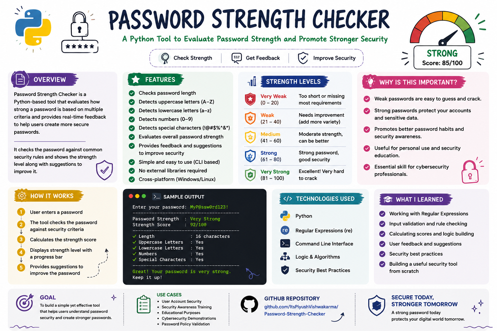
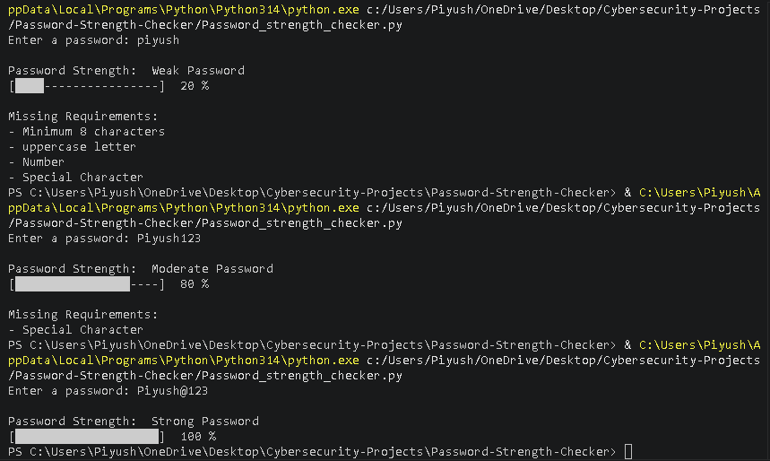

# 🔐 Password Strength Checker

A Python-based Password Strength Checker that evaluates password security based on length, complexity, and character variety. The tool helps users create stronger passwords and understand basic password security principles.

---

## 📊 Project Overview



---

## 🎯 Features

- Evaluates password strength
- Checks password length
- Detects uppercase letters
- Detects lowercase letters
- Detects numbers
- Detects special characters
- Provides password security feedback
- Beginner-friendly cybersecurity project

---

## 🛠 Technologies Used

- Python
- String Operations
- Conditional Statements
- Cybersecurity Fundamentals

---

## ⚙️ How It Works

1. User enters a password.
2. The program analyzes the password.
3. Various security checks are performed:
   - Length validation
   - Uppercase letter detection
   - Lowercase letter detection
   - Number detection
   - Special character detection
4. A strength rating is generated.
5. Security recommendations are displayed.

---

## 🖥 Password Strength Evaluation Example


---

## 🖥 Original Program Output



---

## 📂 Project Structure

```text
Password-Strength-Checker/
│
├── Password_strength_checker.py
├── README.md
│
└── screenshots/
    ├── password-strength-checker-overview.png
    ├── password-strength-checker.png
    └── original-output.png
```

---

## 📚 Skills Learned

- Password Security Concepts
- Authentication Fundamentals
- Python String Handling
- Conditional Logic
- Input Validation
- Cybersecurity Best Practices

---

## 🔒 Password Security Criteria

A strong password should contain:

✅ At least 8 characters

✅ Uppercase letters (A-Z)

✅ Lowercase letters (a-z)

✅ Numbers (0-9)

✅ Special characters (!@#$%^&*)

---

## 💡 Why Password Strength Matters

Weak passwords are vulnerable to:

- Dictionary Attacks
- Brute Force Attacks
- Credential Stuffing
- Unauthorized Access

Strong passwords significantly reduce these risks.

---

## 🌍 Real-World Applications

- User Authentication Systems
- Account Security
- Security Awareness Training
- Cybersecurity Education
- Identity Protection

---

## ⚠️ Disclaimer

This project was developed for educational and cybersecurity learning purposes only.

---

## 👨‍💻 Author

**Piyush Vishwakarma**

MCA (Cybersecurity) Student

Aspiring SOC Analyst | Digital Forensics Learner | Cybersecurity Enthusiast